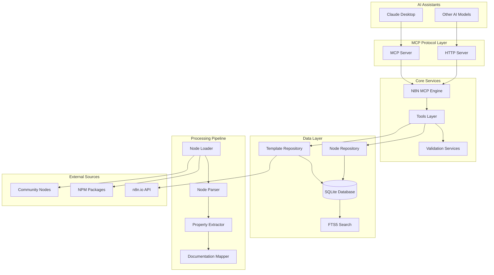
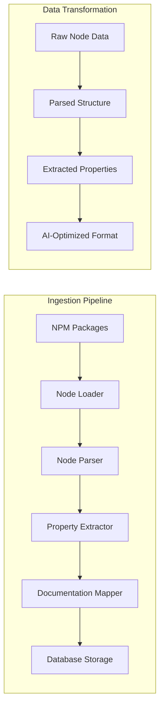
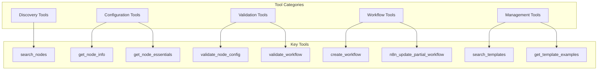
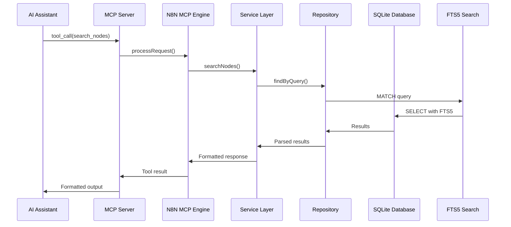
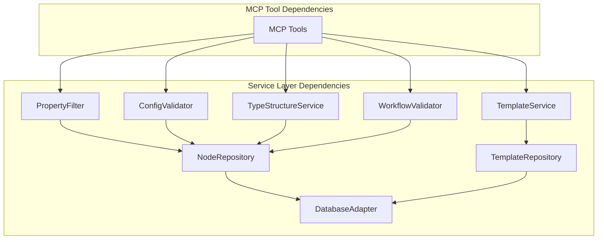

# n8n-MCP Architecture Documentation

## Overview

n8n-MCP is a comprehensive Model Context Protocol (MCP) server that bridges n8n's workflow automation platform with AI assistants. It provides structured access to 1,084 n8n nodes (537 core + 547 community), their properties, operations, documentation, and real-world workflow templates.

## High-Level System Architecture



## Core Components

### 1. MCP Server (`src/mcp/server.ts`)

The primary entry point implementing the Model Context Protocol specification.

**Key Responsibilities:**
- Protocol negotiation and initialization
- Tool registration and execution
- Request/response handling
- Error management and logging
- Session persistence

**Supported Modes:**
- **stdio**: Direct Claude Desktop integration
- **HTTP**: Remote access with authentication
- **Library**: Integration into larger services

### 2. Database Layer (`src/database/`)

Universal SQLite database with adapter pattern supporting multiple environments.

**Schema Components:**
- **nodes**: Core node information (1,084 entries)
- **node_versions**: Version tracking and migration support
- **templates**: Workflow templates (2,709 entries)
- **template_node_configs**: Pre-extracted configurations (2,646 entries)
- **workflow_versions**: Rollback and history tracking
- **version_property_changes**: Detailed migration tracking

**Key Features:**
- FTS5 full-text search for instant node discovery
- Universal adapter pattern (better-sqlite3/sql.js)
- Optimized indexes for common query patterns
- Size: ~45MB with all n8n data

### 3. Node Processing Pipeline

The data ingestion pipeline that transforms n8n packages into searchable database entries.



**Pipeline Stages:**

1. **Node Loader** (`src/loaders/node-loader.ts`)
   - Downloads n8n packages from NPM
   - Handles both core and community packages
   - Version management and updates

2. **Node Parser** (`src/parsers/node-parser.ts`)
   - Extracts node metadata and structure
   - Parses complex type definitions
   - Version compatibility analysis

3. **Property Extractor** (`src/parsers/property-extractor.ts`)
   - Deep property analysis
   - Dependency detection
   - Type structure validation

4. **Documentation Mapper** (`src/mappers/docs-mapper.ts`)
   - Maps external documentation
   - AI-generated summaries
   - Community node integration

### 4. Service Layer (`src/services/`)

Business logic layer providing high-level operations.

#### Core Services

**Property Filter Service**
- Reduces 200+ properties to 10-20 essentials
- AI-friendly configuration extraction
- Usage pattern analysis

**Config Validator Service**
- Multi-profile validation (minimal, runtime, ai-friendly, strict)
- Operation-aware validation
- Node-specific validation logic

**Type Structure Service**
- Validates complex type structures (filter, resourceMapper, etc.)
- 22 predefined type structures
- Structure validation with detailed error reporting

**Expression Validator**
- n8n expression syntax validation
- `{{}}` syntax checking
- `$json`/`$node` variable validation

**Workflow Validator**
- Complete workflow structure validation
- Dependency analysis
- Best practice enforcement

#### Template System (`src/templates/`)

**Template Fetcher**
- Fetches templates from n8n.io API
- Metadata extraction and analysis
- Incremental updates

**Template Repository**
- Database operations for templates
- FTS5 search integration
- Configuration extraction

**Template Service**
- Business logic for template operations
- Search and filtering
- Example generation

## MCP Tools Architecture

The MCP server exposes categorized tools for different workflow development tasks.



### Tool Categories

**1. Discovery Tools**
- `search_nodes`: Find nodes by keyword
- `tools_documentation`: Get tool documentation
- `list_node_categories`: Browse by category

**2. Configuration Tools**
- `get_node_info`: Full node details
- `get_node_essentials`: AI-optimized essentials
- `get_node_examples`: Real-world examples
- `get_template_examples`: Template-based examples

**3. Validation Tools**
- `validate_node_config`: Configuration validation
- `validate_workflow`: Complete workflow validation
- `n8n_validate_workflow`: Enhanced workflow validation

**4. Workflow Tools**
- `create_workflow`: Create new workflows
- `n8n_update_partial_workflow`: Efficient updates
- `n8n_update_full_workflow`: Complete replacements

**5. Template Tools**
- `search_templates`: Find workflow templates
- `get_template_details`: Template information

## Data Flow Architecture

### Typical Request Flow



### Database Query Patterns

**Full-Text Search (FTS5)**
```sql
-- Fast node discovery
SELECT node_type, display_name, description 
FROM nodes_fts 
WHERE nodes_fts MATCH 'webhook database'
ORDER BY rank;
```

**Template Joins**
```sql
-- Template with node configurations
SELECT t.*, tnc.parameters_json
FROM templates t
LEFT JOIN template_node_configs tnc ON t.id = tnc.template_id
WHERE tnc.node_type = ? AND tnc.rank <= 3;
```

## Component Relationships

### Service Dependencies



### Integration Points

**External Systems**
- n8n.io API: Template fetching
- NPM Registry: Package downloads
- Community GitHub: Node verification

**Database Integration**
- SQLite: Primary storage
- FTS5: Full-text search
- Compression: Template storage

**MCP Protocol**
- stdio transport: Claude Desktop
- HTTP transport: Remote access
- Session persistence: Multi-tenant support

## Performance Considerations

### Database Optimization

**Indexing Strategy**
- Primary indexes on frequently queried fields
- Composite indexes for complex queries
- FTS5 indexes for search performance

**Query Optimization**
- Prepared statements for repeated queries
- Connection pooling in HTTP mode
- Caching for expensive operations

### Memory Management

**Session Persistence**
- Automatic session expiration (default 30 min)
- MAX_SESSIONS limit (configurable, default 100)
- Transport recreation on-demand

**Database Size Management**
- Compressed template storage
- Efficient JSON serialization
- Selective field loading

### Response Optimization

**Property Filtering**
- Essential properties: 10-20 vs 200+ total
- AI-optimized data structures
- Lazy loading for expensive operations

**Diff-Based Updates**
- 80-90% token savings on workflow updates
- Transactional updates with rollback
- Change detection and minimization

## Security Architecture

### Authentication

**HTTP Mode**
- Bearer token authentication
- Rate limiting (express-rate-limit)
- CORS configuration

**Session Management**
- Secure session storage
- API key encryption (downstream responsibility)
- Multi-tenant isolation

### Data Protection

**Input Validation**
- Zod schema validation
- SQL injection prevention
- Type safety with TypeScript

**Output Sanitization**
- Structured data formats
- Error message sanitization
- Log filtering for sensitive data

## Deployment Architecture

### Deployment Modes

**Standalone CLI**
```bash
npm start                    # stdio mode
npm run start:http          # HTTP mode
```

**Library Integration**
```typescript
import N8NMCPEngine from 'n8n-mcp';
const engine = new N8NMCPEngine();
```

**Container Deployment**
- Docker images: ~150MB optimized
- Railway deployment ready
- Environment configuration

### Configuration Management

**Environment Variables**
- `MCP_MODE`: stdio/http selection
- `AUTH_TOKEN`: HTTP authentication
- `PORT`: Server port
- `LOG_LEVEL`: Verbosity control

**Instance Context**
- Multi-tenant configuration
- Per-instance database isolation
- Session context management

## Monitoring and Observability

### Logging Architecture

**Structured Logging**
- Request/response tracking
- Error categorization
- Performance metrics

**Telemetry Integration**
- Startup checkpoints
- Health monitoring
- Error reporting

### Health Monitoring

**Engine Health**
```typescript
interface EngineHealth {
  status: 'healthy' | 'unhealthy';
  uptime: number;
  sessionActive: boolean;
  memoryUsage: { used: number; total: number };
  version: string;
}
```

**Database Health**
- Connection status
- Query performance
- Size metrics

## Development Architecture

### Build System

**TypeScript Configuration**
- Strict type checking
- Incremental compilation
- Source map generation

**Testing Architecture**
- Unit tests: Core business logic
- Integration tests: MCP protocol
- E2E tests: Complete workflows
- Benchmark tests: Performance validation

### Code Organization

**Layered Architecture**
- Presentation: MCP tools
- Business: Service layer
- Data: Repository pattern
- Infrastructure: Database, HTTP

**Design Patterns**
- Repository Pattern: Data access abstraction
- Service Layer: Business logic separation
- Validation Profiles: Multi-level validation
- Diff Engine: Efficient updates

## Scaling Architecture

### Horizontal Scaling

**Database Scaling**
- Read replicas for query scaling
- Connection pooling
- Query optimization

**HTTP Server Scaling**
- Stateless design
- Load balancer ready
- Session persistence stateless

### Vertical Scaling

**Memory Optimization**
- Lazy loading strategies
- Cache management
- Database connection limits

**CPU Optimization**
- Query optimization
- Index utilization
- Concurrent request handling

## Future Architecture Considerations

### Extensibility Points

**Plugin Architecture**
- Custom node loaders
- Validation rule extensions
- Template fetcher plugins

**API Evolution**
- Backward compatibility
- Version negotiation
- Migration strategies

### Performance Roadmap

**Database Evolution**
- Migration paths for schema changes
- Performance benchmarking
- Query optimization

**Caching Strategy**
- Multi-layer caching
- Invalidation strategies
- Cache warming

## Troubleshooting Architecture

### Diagnostic Tools

**Health Checks**
- Database connectivity
- MCP server status
- Memory usage analysis

**Debug Logging**
- Request tracing
- Performance profiling
- Error categorization

### Common Issues

**Database Issues**
- Corruption detection
- Repair procedures
- Backup strategies

**Performance Issues**
- Query analysis
- Index optimization
- Memory leak detection

---

## Technical Debt Resolution

**Issue #5 - Missing ARCHITECTURE.md: Developer Onboarding Friction**

This document addresses the technical debt issue #5 by providing comprehensive system architecture documentation that includes:

✅ **High-level system architecture with Mermaid diagrams** - Visual representation of all components and their relationships  
✅ **Component relationships and data flow** - Detailed sequence diagrams and dependency graphs  
✅ **MCP server architecture** - Complete server design with tool categorization  
✅ **Database layer and repositories** - Schema design, indexing strategy, and performance optimization  
✅ **Service layer overview** - All core services with their responsibilities and interactions  
✅ **Integration points** - External systems, APIs, and deployment considerations  
✅ **Performance considerations** - Database optimization, memory management, and response optimization  

**Status: COMPLETED** - This comprehensive architecture documentation significantly reduces developer onboarding friction by providing a complete technical reference for the n8n-MCP system.

---

## Conclusion

n8n-MCP's architecture is designed for scalability, maintainability, and performance. The layered approach ensures clear separation of concerns, while the universal database adapter provides flexibility across deployment environments. The MCP protocol integration enables seamless AI assistant integration, making n8n workflow development more accessible and efficient.

The system processes 1,084 nodes with 99% property coverage and 63.6% operation coverage, backed by 2,709 workflow templates and real-world configuration examples. This comprehensive knowledge base, combined with intelligent filtering and validation services, provides AI assistants with the tools they need to build robust n8n workflows efficiently.

For specific implementation details, refer to the relevant source files and service documentation.